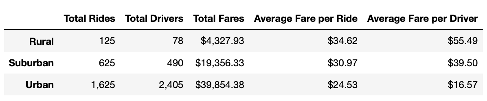

# PyBer_Analysis

## Project Overview and Purpose
The purpose of this analysis was to find the total weekly fares by city type for ride-sharing in 2019 and create a visualization to show the results. I used python and matplotlib in Jupyter Notebook to analyze the data and plot the data points to create the visualization summary.

## Resources
Data Source: city_data.csv and ride_data.csv
Software: Python 3.8.5, Jupyter Notebook

## Results
Using the data from three different city types (Rural, Suburban, and Urban), we can see which areas had the highest ride volume and highest fares. Urban city types had the highest total rides, with 1,625 and rural city types had the lowest total rides, with only 125 rides. Suburban city types had less total rides than urban city types and more total rides than rural city types, with a total of 625 rides. However, rural city types had the highest average fare per ride and the highest average fare per driver while urban city types had the lowest average fare per ride and lowest average fare per driver.  Suburban city types’ average fares were between the urban and rural averages.

The overall total fares were much higher in urban city types due to the volume of total rides, but the average fare drivers were earning per ride was much lower than suburban and urban city types.

In the visualization we can clearly see that urban city types had the highest average fares between January and May, followed by suburban city types and rural city types. The highest fares for each city type was in the end of February. After this, the highest fares vary by city type. In urban and rural city types, the fares spike again in the beginning of April and in suburban areas, the fares spike in the beginning of May.

## Summary
Based on the analysis performed on the ride sharing data, we are able to make recommendations to Pyber for improving disparities among city types. One recommendation would be to provide more drivers in rural areas rather than in urban areas. Currently in rural areas, the ratio of drivers to rides is greater than in urban areas. Hiring less drivers in urban areas will allow drivers to provide more rides and earn more. Another recommendation would be to decrease the fare price in rural areas to drive greater demand for rides. Pyber may also want to focus on which area has the highest fare per week on average. For example, Pyber may want to provide more drivers in rural areas in April and more drivers in suburban areas in May. 

